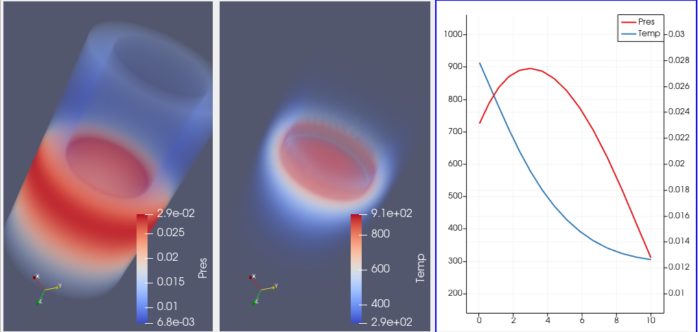
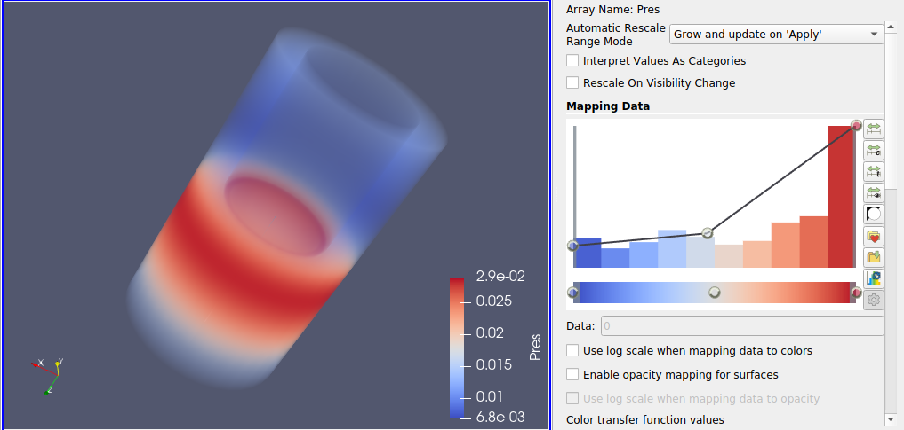
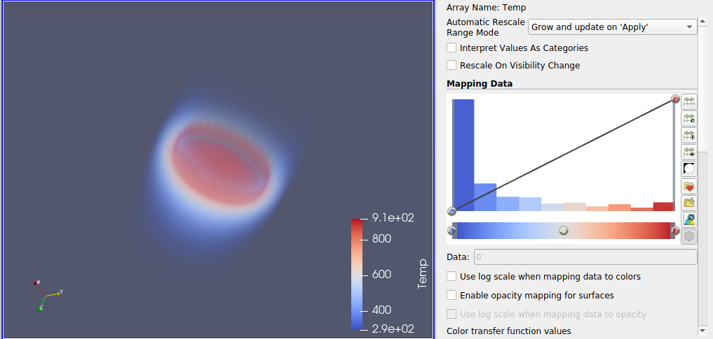

### Visualization 1
**Aim (aim):** This visualization aims to find data attributes, analyse the attributes and thereby plot a graph to see the relation between the attributes. The trend of each data attribute would be inferred by showing the volume representation of the display. The data set used for visualization is the default example data file provided by Paraview (disk_out_ref.ex2). The value of pressure is getting increased at the beginning and then lowered from the point near to 0.028. The temperature on the other hand is decreased right from the value 900 to its end.

**Visual Design Type (vistype):** Volume visualization with line chart

**Image:** 
- - -





**Visual Mappings (vismapping):** The unique concept that is generated from data is to visualize the relation between data attributes in the given volume data set. Hence visualization is done by loading the data into paraview and applied transfer functions to identify the trends and plot a line chart combining both attributes. The data attributes taken here is temperature and pressure. Both of them are visualized separately and enhanced viewing capabilities of trend by altering transfer functions. The next objective was to plot both temperature and pressure in the same window so that it would be more clear for comparing the trend. Both attributes' color coding and opacity determination is in the range from blue to red. Legends are given in each window. Data histogram is also displayed along with the transfer function diagram. For the line chart plot over line is applied and different colors are assigned to data variables. Red color is given to the pressure and blue color is given to the temperature for plotting the line chart.


**Data Preparation (dataprep):** Dataset used here for visualization is an example data set given by paraview. It is loaded into paraview and creates two different windows consisting of data variables such as pressure and temperature. For pressure, color mapping is applied by three points which is given below. 
```
Value 1: 0.00678552, Red: 0.231373, Green: 0.298039, Blue: 0.752941
Value 2: 0.017802, Red: 0.865003, Green: 0.865003, Blue: 0.865003
Value 3: 0.0288185, Red: 0.705882, Green: 0.0156863, Blue: 0.14902
```
Opacity is also applied by three points and the corresponding values are given below.
```
Value 1: 0.00678552, Opacity: 0.15625
Value 2: 0.0172477, Opacity: 0.24375
Value 3: 0.0288185, Opacity: 1
```

For temperature, color mapping is applied by three points and it is explained below.
```
Value 1: 293.15, Red: 0.231373, Green: 0.298039, Blue: 0.752941
Value 2: 603.15, Red: 0.865003, Green: 0.865003, Blue: 0.865003
Value 3: 913.15, Red: 0.705882, Green: 0.0156863, Blue: 0.14902
```
Opacity is applied by two points and the corresponding values are given below.
```
Value 1: 293.15, Opacity: 0
Value 2: 913.15, Opacity: 1
```
A plot over line filter has been applied to plot the line chart. Point 1 and point 2 values of the line are 0,0,0 and 0,0,10 respectively.

**Improvements (improvements):** Couple of improvements could be done by selecting more data variables to plot the chart so that the relation between those variables and pressure or temperature could be analysed. The data could be extracted over a particular area of the data set or slice through some part of the object in order to deeply scrutinize the trend over the extracted data.

