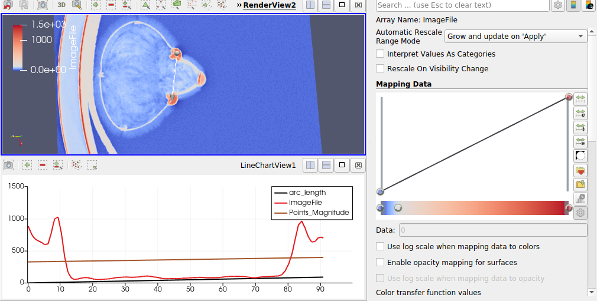

### Visualization 2
**Aim (aim):** From this visualization, it is seen that there are three mushroom-like knob structures which have high data magnitudes. The aim of this visualization is to plot lines over two of the knob structures and analyse how much is the peak magnitude and how much is the value in between two peak magnitudes. The data would be taken from a layer which has the most data visibility by slicing through the X-Y plane. The peak points are identified as (18.3467, 2049.98) and (84.2017,963) after plotting. 

**Visual Design Type (vistype):** Volume visualization using slicing and line chart

**Image:** 
- - -



**Visual Mappings (vismapping):** For this visualization, the data is loaded into paraview and applied to the transfer function to clearly identify the data variations. The representation is selected as a slice to check each layer and identify the layer where most of the information could be gained. A line is drawn in between two knobs to get the data. The plane used to slice here is the X-Y plane. The data over the line is plotted below the visualization object. The line is plotted over the X-Y plane as a surface representation. The most peak visibility of the data is at the slice number 15. Hence the Z axis value for two endpoints of the line is 15. Legends are given by default. In pipeline browser on plotoverline, "show line" property is checked in order to get a view of the line. Orientation axes visibility is also checked true. Probe type for plotoverline is selected as a high resolution line source. While plotting data in the graph, black color is chosen for arc_length, red is for ImageFile and brown is for points_magnitude.


**Data Preparation (dataprep):** Dataset used here is data1.raw. This data file is loaded into paraview and applied the following properties.
File dimensionality is selected as 3. Data extent is given as (0, 511), (0, 511) and (0, 62).
Data scalar type is short and data byte order is BigEndian. Number of scalar components is given as 1. Data origin and data spacing are (0,0,0) and (1,1,1) respectively.

Transfer functions applied with color values are as below
```
Value 1: 0, Red: 0.231373, Green: 0.298039, Blue: 0.752941
Value 2: 140.755, Red: 0.865003, Green: 0.865003, Blue: 0.865003
Value 3: 1492, Red: 0.705882, Green: 0.0156863, Blue: 0.14902
```
Opacity transfer function values are given below
```
Value 1: 0, Opacity: 0
Value 2: 1492, Opacity: 1
```
The data is sliced over 62 slices and the 15th slice has been taken to find the peak values. Data over line filters has applied to this slice and the line is stretched between two knobs. Point 1 and point 2 have the coordinates (194.933, 262.76, 15) and (284.569,277.455,15) respectively. The length of the line is 90.8325. The representation of the plot over line has been chosen as surface and a plot data filter has been applied to plot a line chart with the following data arc_length, ImageFile and Points_Magnitude which is mapped on the same plot. Attribute type is point data.


**Improvements (improvements):** Instead of restricting two points, taking three knobs into consideration could be an improvement so that a triangle could be formed with three knobs and plot data for observing the trend between these points. Slicing could be done on XZ and YZ planes also and find if the data has changed or not.

