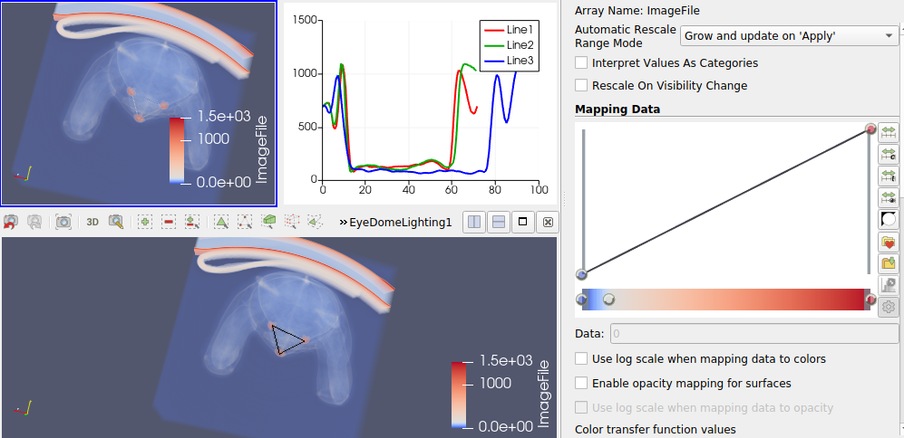

### Visualization 3
**Aim (aim):** This visualization aims to produce a detailed analysis of data between three knob-like structures in the volume data set and infer that the data between those points are not similar or identical. This could be used for finding the distance between three points by analysing the peak data points of three lines. From the visualization it could be found that there are two identical data trends and the other one as more lengthier X axis values. The data has been taken from a layer which has the most data visibility.

**Visual Design Type (vistype):** Volume visualization using volume data and line chart

**Image:** 
- - -



**Visual Mappings (vismapping):** For this visualization, the data is loaded into paraview and transfer function is applied to clearly identify the knob-like structures inside the data set. The representation is selected as volume for the dataset. Three lines are drawn and formed a triangle. The data is plotted on the right side of the volume image representation. Line 1, Line 2 and Line 3 have given red, green and blue colours respectively. It is identified as the third line has more length than the other two. For showing the lines between the knobs, eye-dome lighting is applied and shown in a separate window. Representation of this model is chosen as volume. Volume rendering mode is chosen as smart and blend mode is chosen as composite. Appropriate legends are shown on each window as well. The windows of both volume data and eye-dome lighting is linked together. Camera angle is set from the top to visualize the extracted data between lines. Orientation axes visibility is also set as marked.


**Data Preparation (dataprep):** Dataset used here is data1.raw. This data file is loaded into paraview and applied the following properties.
File dimensionality is selected as 3. Data extent is given as (0, 511), (0, 511) and (0, 62).
Data scalar type is short and data byte order is BigEndian. Number of scalar components is given as 1. Data origin and data spacing are (0,0,0) and (1,1,1) respectively.

Transfer functions applied with color values are as below
```
Value 1: 0, Red: 0.231373, Green: 0.298039, Blue: 0.752941
Value 2: 140.755, Red: 0.865003, Green: 0.865003, Blue: 0.865003
Value 3: 1492, Red: 0.705882, Green: 0.0156863, Blue: 0.14902
```
Opacity transfer functions are given below
```
Value 1: 0, Opacity: 0
Value 2: 1492, Opacity: 1
```

Data over line filter has applied between three points. Point 1, point 2, and point 3 have the coordinates (250.606, 214.583, 15), (284.569, 277.455, 15) and (196.693, 260.879, 15) respectively. Line 1 is drawn from point 1 to point 2. Line 2 is drawn from point 2 to point 3 and line 3 is drawn from point 1 to point 3 and thus forms a triangle. Eye-dome lighting is applied to the volume rendering and the same transformation is applied which is given above. 


**Improvements (improvements):** Even though the data is plotted with three different colors on a single plot, it was unable to find what kind of data is plotted in the graph. Statistical transformation of data such as k means or principal component analysis also could be applied in order to find more interesting phenomenons in the data set.

