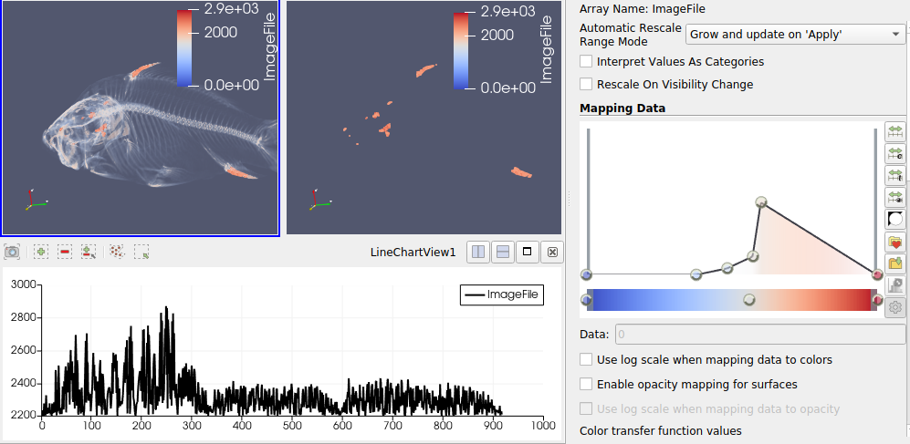

### Visualization 4
**Aim (aim):** The main aim of this visualization is to identify what kind of data model hidden in the given data set (dat2.raw) and find what all parts of the object have peak values which are greater than or equal to 2200. From the visualization, it is inferred that the hidden object is a fish bone structure in a 3D way. The data which has values greater than or equal to 2200 are identified as the top and bottom fin of the fish bone, and some parts of the head such as upper jaw, lower jaw and operculum.

**Visual Design Type (vistype):** Volume visualization

**Image:** 
- - -



**Visual Mappings (vismapping):** The data is loaded into paraview and transfer functions are applied. The data "ImageFile" values are shown as legend on top right side of the visualization. The parts of the object having values greater than or equal to 2200 are given with different colors. Here it's given as dark reddish brown. For better viewability of selected data, the camera angle is set from the top right corner of the object. Since the data on the head part of the bone is not clearly visible, the extracted data is shown lonely in a separate window on the right side and a graph just below the volume visualization. The cameras of object and extracted content are linked together as well. The representation of the object is set to volume. Orientation axes are also shown on the bottom left corner of the window where the object is visualized.


**Data Preparation (dataprep):** Dataset used here is data2.raw. This data file is loaded into paraview and applied the following properties.
File dimensionality is selected as 3. Data extent is given as (0, 255), (0, 255) and (0, 511).
Data scalar type is short and data byte order is BigEndian. Number of scalar components is given as 1. Data origin and data spacing are (0,0,0) and (1,1,1) respectively.

Transfer functions are applied by six points in opacity and three points in color which is depicted below.
Color values are
```
Value 1: 0, Red: 0.231373, Green: 0.298039, Blue: 0.752941
Value 2: 1607.04, Red: 0.865003, Green: 0.865003, Blue: 0.865003
Value 3: 2871, Red: 0.705882, Green: 0.0156863, Blue: 0.14902
```
Opacity transfer function values are given below
```
Value 1: 0, Opacity: 0
Value 2: 1083.4, Opacity: 0
Value 3: 1390.36, Opacity: 0.04375
Value 4: 1643.15, Opacity: 0.125
Value 5: 1724.41, Opacity: 0.49375
Value 6: 2871, Opacity: 0
```
From the whole data found from the data set, the aim was to extract the values greater than or equal to 2200. From paraview, the option to filter data from various criteria is chosen. From the selection window, points have been selected to choose ImageFile values. This process was followed by selecting "is >=" from the dropdown and given 2200 in the text box.


**Improvements (improvements):** The data extraction could be done in different ways. Not just greater than or equal to 2200. The extracted data could be plotted and would have shown different trends in those data.

