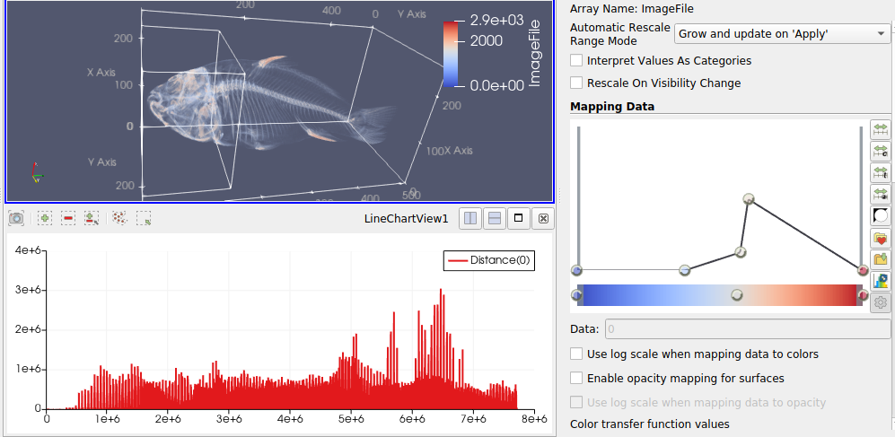

### Visualization 5
**Aim (aim):** The aim of this visualization is to extract data from the head part of the fish bone data and find K-means for all the data and identify the longest distances by plotting the trend of distances in a graph. From the visualization it is clear that the data is extracted from the head of the fish bone and looking into the plot, it is seen that the data is upsurge at the end.

**Visual Design Type (vistype):** Volume visualization by subset

**Image:** 
- - -



**Visual Mappings (vismapping):** The data set is loaded in paraview and from the visualization is done as volume.The subset of the data extracted is shown as outline which is in the top window of the visualization. Transfer functions are also applied to clearly visible the head part. The camera angle is set in between the top and side part of the object. For the graph, the data values are represented in red color. Among the values obtained from applying k-means, the distance variable is plotted in the graph. Orientation axes visibility is enabled in visualization and appropriate legends are also given in the top right corner. The axes grid is selected as well. K-means statistical model is exported as spreadsheet and attached (statistical_model_viz5.csv). For plotting data, attribute type is chosen as point data. Three different variables were available such as Closest id, distance and imagefile. Among these three, distance is chosen to plot on the graph.


**Data Preparation (dataprep):** Dataset used here is data2.raw. This data file is loaded into paraview and applied the following properties.
File dimensionality is selected as 3. Data extent is given as (0, 255), (0, 255) and (0, 511).
Data scalar type is short and data byte order is BigEndian. Number of scalar components is given as 1. Data origin and data spacing are (0,0,0) and (1,1,1) respectively.

Transfer functions are applied by five points in opacity and three points in color which is depicted below.
Color values are
```
Value 1: 0, Red: 0.231373, Green: 0.298039, Blue: 0.752941
Value 2: 1607.04, Red: 0.865003, Green: 0.865003, Blue: 0.865003
Value 3: 2871, Red: 0.705882, Green: 0.0156863, Blue: 0.14902
```
Opacity transfer function values are given below
```
Value 1: 0, Opacity: 0
Value 2: 1083.4, Opacity: 0
Value 3: 1643.15, Opacity: 0.125
Value 5: 1724.41, Opacity: 0.49375
Value 6: 2871, Opacity: 0
```
The data set is loaded and identifies the data as a fish bone object. Data extraction is done as a subset which is taken from the head part of the fish bone. The representation of the data subset is selected as an outline with opacity 1. Maximum number of labels is given as 100. This is followed by applying the k-means statistical filter to the extracted subset of data. For the statistical model of k-means, the task is selected as "Model and assess the same data". Other properties are as follows.
```
Training Fraction: 0.1
Value of k: 5
Maximum iterations: 50
Tolerance: 0.01
```

**Improvements (improvements):** Multiple subsets of data could be filtered from the data set and could compare statistical filters. For example, a subset of data from tail could be taken and by applying the same filters analyse what all differences are there when applying k means. While plotting the data, closest id could also be selected and shown along with the distance which might be helpful while comparing the trends.

